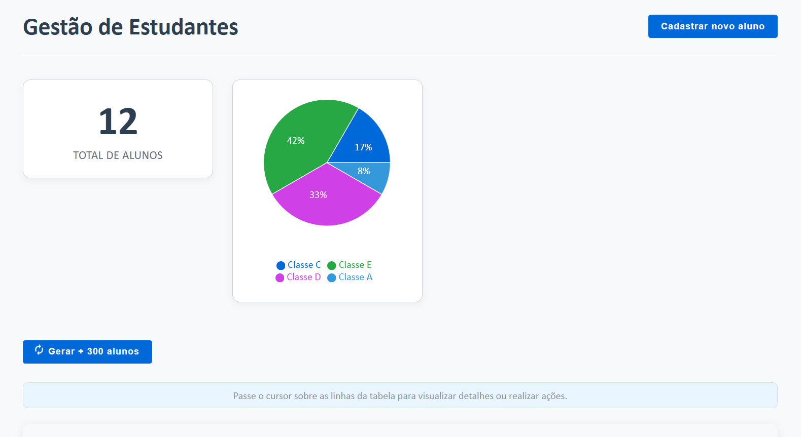
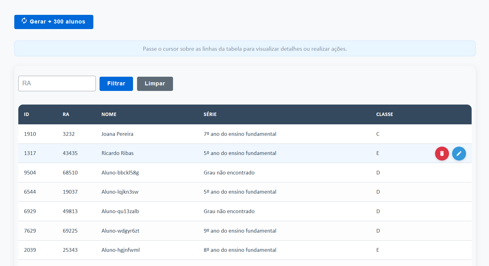
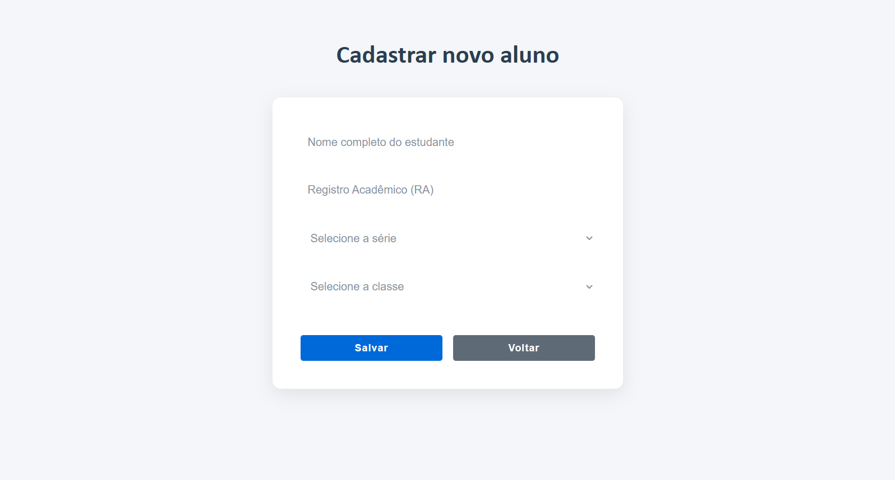

# My Education App






## Rodando o projeto

### Rodando o servidor backend
Isso vai subir um servidor fake para poder simular que temos uma API funcionando, é bom que ele seja iniciado antes da interface.
Ele se baseia num arquivo JSON que criei, em data/data.json, e cria as rotas. 
```npx json-server --watch data/data.json```

Obs: Percebi que as vezes esse recurso trava, principalmente quando tentava deletar alunos, então vi que era uma questão de parar
esse servidor e reiniciá-lo, é rápido, questão de segundos.

Endpoints:
http://localhost:3000/students
http://localhost:3000/degrees
http://localhost:3000/classes
http://localhost:3000/relashionships
http://localhost:3000/matters
http://localhost:3000/teachers

### Rodando o frontend
Na raíz do projeto rode o comando ```npm run dev``` e ele vai estar rodando na url: http://localhost:5173/

Rotas:
http://localhost:5173/estudantes
http://localhost:5173/editar-estudante/id
http://localhost:5173/professores


## Comentários

### Adicionei um servidor backend "fake" para servir como API
Imaginei que seria interessante poder ter no frontend uma camada de integração com uma API externa, então lembrei de uma biblioteca que
poderia simular isso através de dados fornecidos via JSON, a JSON server.
### Outras implementações
- Gostaria de ter implementado outros gráficos, filtros para a tabela de alunos, e outras páginas porém não houve tempo.
### Pensei em um projeto que possa crescer
Algumas das coisas que fiz podem ser demais para esse projeto, já que é pequeno, mas tentei fazer de uma forma como se fosse escalar.
- Por exemplo o CSS tem o main.scss, onde eu coloquei estilos que poderiam ser utilizados em outras partes da aplicação, por exemplo estilos de tabelas. E também o estilo por componentes e páginas.
- Separação de pastas em componentes e páginas, pensando também numa futura organização 
### Escolha do SASS
- Usei SASS pela rapidez e pelas facilidades que ele oferece, e o CSS modules para não ter conflitos de classes de estilizações

